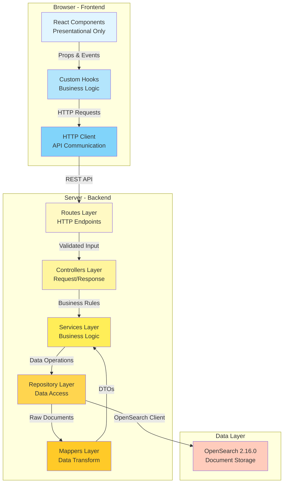
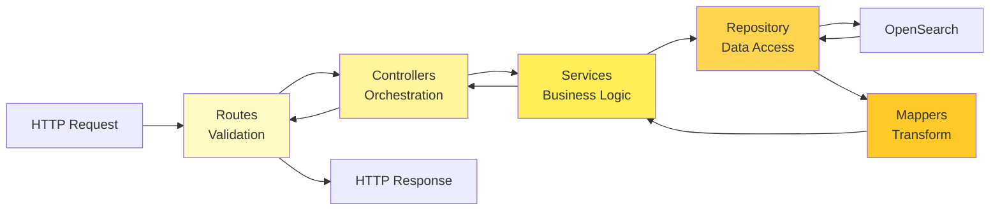
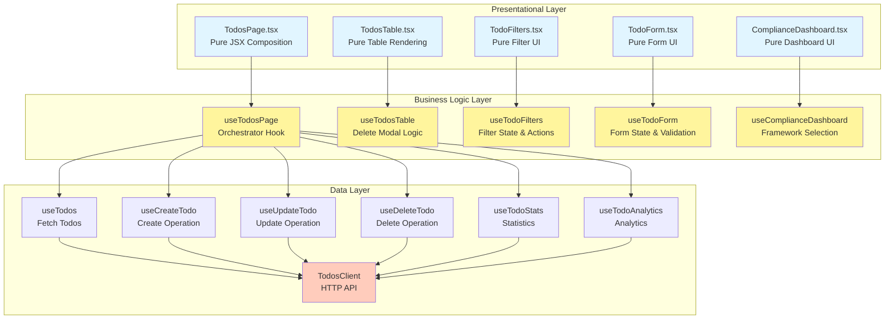
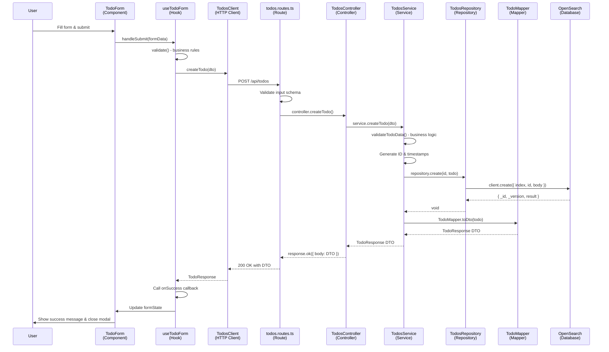

# Architecture Guide

## Table of Contents

- [Overview](#overview)
- [System Architecture](#system-architecture)
- [Backend Architecture](#backend-architecture)
- [Frontend Architecture](#frontend-architecture)
- [Data Flow](#data-flow)
- [Design Patterns](#design-patterns)
- [Technology Stack](#technology-stack)
- [Directory Structure](#directory-structure)
- [Integration Points](#integration-points)
- [Security Considerations](#security-considerations)

## Overview

The TODO Management Plugin for OpenSearch Dashboards is built with a strict layered architecture that enforces clear separation of concerns, maintainability, and testability. The plugin implements enterprise-grade design patterns and follows the official OpenSearch Dashboards plugin development guidelines.

### Key Architectural Principles

1. **Separation of Concerns**: Each layer has a single, well-defined responsibility
2. **Dependency Inversion**: High-level modules depend on abstractions, not concrete implementations
3. **Single Source of Truth**: OpenSearch is the only data source; all state derives from it
4. **Type Safety**: Full TypeScript implementation with strict type checking
5. **Testability**: All layers are independently testable with clear boundaries
6. **Scalability**: Stateless design allows horizontal scaling
7. **Presentational Components**: Frontend components are pure presentation with zero business logic (PROJECT RULE #11)

## System Architecture

The plugin follows a dual-sided architecture with complete separation between client and server:



### Architecture Layers

The plugin consists of **8 distinct layers**:

#### Frontend (3 Layers)

1. **React Components (UI Layer)**: Pure presentational components with zero business logic
2. **Custom Hooks**: Business logic, state management, API orchestration
3. **HTTP Client**: API communication with backend

#### Backend (5 Layers)

4. **Routes Layer**: HTTP endpoint definitions and input validation
5. **Controllers Layer**: Request/response handling and error mapping
6. **Services Layer**: Business logic and orchestration
7. **Repository Layer**: Single point of OpenSearch interaction (PROJECT RULE #2)
8. **Mappers Layer**: Data transformation between OpenSearch documents and DTOs

## Backend Architecture

### 5-Layer Backend Pattern

The backend follows a strict 5-layer architecture where each layer has a single responsibility and communicates only with adjacent layers.



### Layer 1: Routes (`src/server/routes/`)

**Responsibility**: Define HTTP endpoints and validate incoming requests.

**Key Files**:
- `todos.routes.ts`: All TODO-related routes (6 REST endpoints)

**Functions**:
- Route registration with HTTP verbs (GET, POST, PATCH, DELETE)
- Input validation using `@osd/config-schema`
- Request-scoped OpenSearch client injection
- Error boundary for route-level exceptions

**Example**:

```typescript
// src/server/routes/todos.routes.ts
router.get(
  {
    path: '/api/custom_plugin/todos',
    validate: {
      query: schema.object({
        page: schema.number({ defaultValue: 1, min: 1 }),
        pageSize: schema.number({ defaultValue: 20, min: 1, max: 100 }),
        searchText: schema.maybe(schema.string()),
        status: schema.maybe(schema.arrayOf(schema.string())),
        // ... more validation
      }),
    },
  },
  async (context, request, response) => {
    const client = context.core.opensearch.client.asCurrentUser;
    const repository = new TodosRepository(client);
    const service = new TodosService(repository);
    const controller = new TodosController(service);

    return await controller.listTodos(request, response);
  }
);
```

**Key Principle**: **No business logic in routes** (PROJECT RULE #3). Routes only validate and delegate.

### Layer 2: Controllers (`src/server/controllers/`)

**Responsibility**: Handle HTTP request/response lifecycle and error mapping.

**Key Files**:
- `todos.controller.ts`: Request parsing and response formatting

**Functions**:
- Extract and parse query parameters
- Call service methods with parsed input
- Transform service results into HTTP responses
- Map application errors to HTTP status codes (via `HttpErrorMapper`)
- Return standardized response formats

**Example**:

```typescript
// src/server/controllers/todos.controller.ts
export class TodosController {
  constructor(private service: TodosService) {}

  async listTodos(request: OpenSearchDashboardsRequest, response: OpenSearchDashboardsResponseFactory) {
    try {
      const params = parseListTodosRequest(request.query);
      const result = await this.service.listTodos(params);

      return response.ok({
        body: {
          data: result.todos,
          pagination: result.pagination,
        },
      });
    } catch (error) {
      return HttpErrorMapper.toHttpResponse(error, response);
    }
  }
}
```

**Key Principle**: Controllers never contain business logic; they only orchestrate and format.

### Layer 3: Services (`src/server/services/`)

**Responsibility**: Implement business logic and orchestrate data operations.

**Key Files**:
- `todos.service.ts`: CRUD operations, validation, business rules
- `todo_stats.service.ts`: Analytics and aggregations

**Functions**:
- Validate business rules (e.g., title length, tag count limits)
- Orchestrate repository calls
- Manage automatic timestamp updates (created, updated, completed)
- Apply business constraints (e.g., completedAt set when status = 'done')
- Coordinate multiple repository operations if needed
- Throw custom application errors (`NotFoundError`, `ValidationError`, etc.)

**Example**:

```typescript
// src/server/services/todos.service.ts
export class TodosService {
  constructor(private repository: TodosRepository) {}

  async createTodo(data: CreateTodoRequest): Promise<TodoResponse> {
    // Business validation
    this.validateTodoData(data);

    // Generate ID and timestamps
    const id = uuidv4();
    const now = new Date().toISOString();

    const todo: Todo = {
      id,
      title: data.title,
      status: data.status,
      createdAt: now,
      updatedAt: now,
      completedAt: data.status === 'done' ? now : null,
      // ... more fields
    };

    // Delegate to repository
    await this.repository.create(id, todo);

    // Return DTO (not raw OpenSearch response)
    return TodoMapper.toDto(todo);
  }
}
```

**Key Principle**: Services orchestrate business logic but never directly interact with OpenSearch (PROJECT RULE #2).

### Layer 4: Repository (`src/server/repositories/`)

**Responsibility**: Single point of OpenSearch interaction (data access boundary).

**Key Files**:
- `todos.repository.ts`: All OpenSearch CRUD operations
- `index_manager.ts`: Index creation and schema management

**Functions**:
- Execute OpenSearch queries (search, get, create, update, delete)
- Build OpenSearch query DSL
- Handle pagination and sorting
- Manage index lifecycle
- Return raw OpenSearch documents (no transformation here)

**Example**:

```typescript
// src/server/repositories/todos.repository.ts
export class TodosRepository {
  constructor(private client: OpenSearchClient) {}

  async search(params: SearchParams): Promise<SearchResponse> {
    const query = this.buildQuery(params);

    const response = await this.client.search({
      index: DEFAULT_INDEX_NAME,
      body: query,
    });

    return response.body; // Raw OpenSearch response
  }

  async create(id: string, todo: Todo): Promise<void> {
    await this.client.create({
      index: DEFAULT_INDEX_NAME,
      id,
      body: todo,
      refresh: 'wait_for', // Ensure immediate visibility
    });
  }
}
```

**Key Principle**: **Only repositories interact with OpenSearch** (PROJECT RULE #2). This creates a single boundary for all data access, making it easy to mock for testing or swap implementations.

### Layer 5: Mappers (`src/server/mappers/`)

**Responsibility**: Transform data between OpenSearch documents and DTOs.

**Key Files**:
- `todos.mapper.ts`: Bidirectional mapping between Todo entities and DTOs

**Functions**:
- Convert OpenSearch documents to DTOs (for API responses)
- Convert DTOs to OpenSearch documents (for storage)
- Handle field name transformations (snake_case ↔ camelCase if needed)
- Strip internal metadata (e.g., `_id`, `_source`)
- Apply default values
- Ensure type safety

**Example**:

```typescript
// src/server/mappers/todos.mapper.ts
export class TodoMapper {
  static toDto(source: Todo): TodoResponse {
    return {
      id: source.id,
      title: source.title,
      description: source.description || '',
      status: source.status,
      tags: source.tags || [],
      assignee: source.assignee,
      priority: source.priority || 'medium',
      severity: source.severity || 'low',
      dueDate: source.dueDate,
      complianceFrameworks: source.complianceFrameworks || [],
      createdAt: source.createdAt,
      updatedAt: source.updatedAt,
      completedAt: source.completedAt,
    };
  }

  static fromCreateRequest(data: CreateTodoRequest, id: string, now: string): Todo {
    return {
      id,
      title: data.title,
      description: data.description,
      status: data.status,
      tags: data.tags || [],
      assignee: data.assignee,
      priority: data.priority || 'medium',
      severity: data.severity || 'low',
      dueDate: data.dueDate,
      complianceFrameworks: data.complianceFrameworks || [],
      createdAt: now,
      updatedAt: now,
      completedAt: data.status === 'done' ? now : null,
    };
  }
}
```

**Key Principle**: **Never expose raw OpenSearch responses to the UI** (PROJECT RULE #1). Always map to DTOs.

### Error Handling (`src/server/errors/`)

**Custom Error Hierarchy**:

```typescript
// src/server/errors/app_errors.ts
export class NotFoundError extends Error {
  constructor(message: string) {
    super(message);
    this.name = 'NotFoundError';
  }
}

export class ValidationError extends Error {
  constructor(message: string) {
    super(message);
    this.name = 'ValidationError';
  }
}

export class ConflictError extends Error {
  constructor(message: string) {
    super(message);
    this.name = 'ConflictError';
  }
}
```

**HTTP Error Mapping**:

```typescript
// src/server/errors/http_error_mapper.ts
export class HttpErrorMapper {
  static toHttpResponse(error: Error, response: OpenSearchDashboardsResponseFactory) {
    if (error instanceof NotFoundError) {
      return response.notFound({ body: { message: error.message } });
    }
    if (error instanceof ValidationError) {
      return response.badRequest({ body: { message: error.message } });
    }
    if (error instanceof ConflictError) {
      return response.conflict({ body: { message: error.message } });
    }
    // Default 500 for unknown errors
    return response.internalError({ body: { message: 'Internal server error' } });
  }
}
```

## Frontend Architecture

### Presentational Component Pattern (PROJECT RULE #11)

The frontend strictly follows the **Presentational Component Pattern** where:

1. **React Components**: Pure presentation with zero business logic
2. **Custom Hooks**: Contain all business logic, state management, and API calls
3. **HTTP Client**: Handles API communication

This pattern enforces a clean separation between **what to render (UI)** and **how to manage state (hooks)**.



### Custom Hooks Architecture

The frontend uses **12 custom hooks** organized into two categories:

#### Orchestrator Hooks (Complex State Management)

These hooks manage complex UI workflows and compose multiple data hooks:

1. **`useTodosPage`** (`src/public/features/todos/hooks/use_todos_page.ts`)
   - **Responsibility**: Orchestrate the entire TodosPage component
   - **State**: Tab selection, modal state, filter state, pagination, sorting
   - **Composes**: `useTodos`, `useTodoStats`, `useTodoAnalytics`, `useCreateTodo`, `useUpdateTodo`, `useDeleteTodo`
   - **Returns**: `{ data, uiState, actions }`

   ```typescript
   export const useTodosPage = ({ http, notifications }) => {
     // UI State
     const [selectedTab, setSelectedTab] = useState('table');
     const [isFormOpen, setIsFormOpen] = useState(false);

     // Filter State
     const [searchText, setSearchText] = useState('');
     const [selectedStatuses, setSelectedStatuses] = useState([]);

     // Pagination State
     const [currentPage, setCurrentPage] = useState(1);
     const [pageSize, setPageSize] = useState(20);

     // Compose data hooks
     const { todos, pagination, loading, refresh } = useTodos({ client, params });
     const { stats } = useTodoStats({ client });
     const { analytics } = useTodoAnalytics({ client });

     // CRUD hooks
     const { createTodo } = useCreateTodo({ client, notifications, onSuccess: refresh });
     const { updateTodo } = useUpdateTodo({ client, notifications, onSuccess: refresh });
     const { deleteTodo } = useDeleteTodo({ client, notifications, onSuccess: refresh });

     return {
       data: { todos, pagination, stats, analytics },
       uiState: { selectedTab, isFormOpen, loading },
       actions: { setSelectedTab, handleCreateClick, handleEditClick, deleteTodo },
     };
   };
   ```

2. **`useTodosTable`** (`src/public/features/todos/hooks/use_todos_table.ts`)
   - **Responsibility**: Manage delete confirmation modal
   - **State**: `todoToDelete`, pagination config, sorting config
   - **Returns**: `{ data, actions }`

3. **`useTodoFilters`** (`src/public/features/todos/hooks/use_todo_filters.ts`)
   - **Responsibility**: Manage all filter state (8 date ranges, search, status, priority, severity)
   - **State**: Popover visibility, local input values, 8 date range fields
   - **Returns**: `{ data, uiState, actions }`

4. **`useTodoForm`** (`src/public/features/todos/hooks/use_todo_form.ts`)
   - **Responsibility**: Manage form state, validation, and submission
   - **State**: All form fields, validation errors
   - **Composes**: `useTodoSuggestions` (for tag/framework autocomplete)
   - **Returns**: `{ data, formState, actions }`

5. **`useComplianceDashboard`** (`src/public/features/todos/hooks/use_compliance_dashboard.ts`)
   - **Responsibility**: Manage compliance framework filter selection
   - **State**: Selected framework
   - **Returns**: `{ data, actions }`

#### Data Hooks (API Operations)

These hooks handle API communication and data fetching:

6. **`useTodos`**: Fetch paginated TODO list with filters
7. **`useCreateTodo`**: Create new TODO
8. **`useUpdateTodo`**: Update existing TODO
9. **`useDeleteTodo`**: Delete TODO
10. **`useTodoStats`**: Fetch general statistics
11. **`useTodoAnalytics`**: Fetch compliance analytics
12. **`useTodoSuggestions`**: Fetch tag/framework suggestions

### Hook Return Pattern

All hooks follow a consistent return pattern for predictability:

```typescript
// Pattern for orchestrator hooks
return {
  data: { /* read-only data */ },
  uiState: { /* UI state values */ },
  actions: { /* event handlers and state setters */ }
};

// Pattern for data hooks
return {
  data: { /* fetched data */ },
  loading: boolean,
  error: Error | null,
  refresh: () => void
};
```

### Presentational Components

All React components are **pure presentational** with this structure:

```typescript
export const TodosPage: React.FC<Props> = ({ http, notifications }) => {
  // 1. Call orchestrator hook
  const { data, uiState, actions } = useTodosPage({ http, notifications });

  // 2. Destructure for readability
  const { todos, pagination, stats } = data;
  const { loading, isFormOpen } = uiState;
  const { handleCreateClick, deleteTodo } = actions;

  // 3. Render only JSX - NO business logic
  return (
    <EuiPage>
      <EuiButton onClick={handleCreateClick}>Create</EuiButton>
      <TodosTable
        todos={todos}
        loading={loading}
        onDelete={deleteTodo}
      />
    </EuiPage>
  );
};
```

**Key Principles**:
- Components receive `{ data, uiState, actions }` from hooks
- Components only render JSX and wire event handlers
- NO useState, useEffect, or business logic in components
- ALL logic lives in custom hooks

### HTTP Client (`src/public/features/todos/api/`)

**Responsibility**: API communication with backend.

**Key File**: `todos.client.ts`

**Functions**:
- Construct HTTP requests with proper headers
- Serialize request bodies (JSON)
- Deserialize response bodies
- Handle HTTP errors
- Type-safe API contracts using DTOs

**Example**:

```typescript
// src/public/features/todos/api/todos.client.ts
export class TodosClient {
  constructor(private http: HttpSetup) {}

  async listTodos(params: ListTodosRequest): Promise<ListTodosResponse> {
    const query = new URLSearchParams();
    if (params.page) query.set('page', params.page.toString());
    if (params.pageSize) query.set('pageSize', params.pageSize.toString());
    // ... more params

    const response = await this.http.get<ListTodosResponse>(
      `/api/custom_plugin/todos?${query.toString()}`
    );

    return response;
  }
}
```

**Key Principle**: **Frontend only calls BFF endpoints** (PROJECT RULE #4). No direct OpenSearch access.

## Data Flow

### Request Flow (Create TODO Example)



### Key Flow Characteristics

1. **Validation at Boundaries**:
   - **Route Layer**: Schema validation (type checking, required fields)
   - **Service Layer**: Business validation (length limits, business rules)
   - **Hook Layer**: UI validation (form field validation)

2. **Data Transformation**:
   - **Frontend → Backend**: Component state → DTO → Service entity
   - **Backend → Frontend**: OpenSearch document → Entity → DTO → Component state

3. **Error Propagation**:
   - Service throws custom errors (`ValidationError`, `NotFoundError`)
   - Controller catches and maps to HTTP status codes
   - Frontend displays user-friendly error messages

## Design Patterns

### 1. Repository Pattern

**Purpose**: Encapsulate data access logic and provide a collection-like interface.

**Implementation**:
- Single class (`TodosRepository`) for all OpenSearch operations
- Injected with request-scoped OpenSearch client
- Returns raw documents (no transformation)
- Makes testing easy (mock the repository)

**Benefits**:
- Single point of data access (PROJECT RULE #2)
- Easy to swap implementations (e.g., use PostgreSQL instead)
- Simplifies testing (mock repository instead of OpenSearch)

### 2. Data Transfer Object (DTO) Pattern

**Purpose**: Define explicit API contracts between layers.

**Implementation**:
- Defined in `src/common/todo/todo.dtos.ts`
- Separate types for requests and responses
- Never expose internal entities to frontend

**Benefits**:
- API contract stability (internal changes don't break frontend)
- Type safety across layers
- Clear documentation of API surface

### 3. Mapper Pattern

**Purpose**: Transform data between different representations.

**Implementation**:
- `TodoMapper` with static methods
- Bidirectional mapping (entity ↔ DTO)
- Field normalization (defaults, transformations)

**Benefits**:
- Centralized transformation logic
- Ensures consistency
- Hides internal implementation details

### 4. Dependency Injection

**Purpose**: Decouple dependencies and improve testability.

**Implementation**:
- Constructor injection for all layers
- Request-scoped OpenSearch client
- Services receive repositories, controllers receive services

**Benefits**:
- Easy to mock dependencies in tests
- Loose coupling between layers
- Supports multiple implementations

### 5. Custom Hook Pattern (Frontend)

**Purpose**: Extract and reuse stateful logic in React components.

**Implementation**:
- 12 custom hooks for different concerns
- Hooks compose other hooks
- Components remain pure and presentational

**Benefits**:
- Separation of concerns (UI vs. logic)
- Reusable business logic
- Easier testing (test hooks independently)

### 6. Presentational Component Pattern (PROJECT RULE #11)

**Purpose**: Enforce pure presentation in React components with zero business logic.

**Implementation**:
- Components call hooks to get `{ data, uiState, actions }`
- Components only render JSX and wire event handlers
- All state management and business logic in hooks

**Benefits**:
- Components are easy to reason about (just rendering)
- Business logic is centralized and testable
- Clear separation between "what to show" and "how to manage state"
- Components can be easily replaced or redesigned without touching business logic

## Technology Stack

### Backend Technologies

| Technology | Version | Purpose |
|------------|---------|---------|
| OpenSearch Dashboards | 2.16.0 | Plugin platform and UI framework |
| Node.js | 18+ | Server runtime (from OSD) |
| TypeScript | 4.9+ | Type-safe JavaScript |
| @osd/config-schema | 2.16.0 | Input validation |
| OpenSearch Client | 2.16.0 | Database communication |
| uuid | Latest | ID generation |

### Frontend Technologies

| Technology | Version | Purpose |
|------------|---------|---------|
| React | 17+ | UI framework |
| @elastic/eui | Latest | UI component library |
| TypeScript | 4.9+ | Type-safe JavaScript |
| @osd/i18n | 2.16.0 | Internationalization |
| moment | Latest | Date manipulation |

### Testing Technologies

| Technology | Version | Purpose |
|------------|---------|---------|
| Jest | 29+ | Test runner |
| @testing-library/react | Latest | Component testing |
| @testing-library/jest-dom | Latest | DOM matchers |
| @testing-library/user-event | Latest | User interaction simulation |

### Data Layer

| Technology | Version | Purpose |
|------------|---------|---------|
| OpenSearch | 2.16.0 | Document database and search engine |
| Docker | Latest | Container runtime |
| Docker Compose | Latest | Multi-container orchestration |

## Directory Structure

```
src/
├── common/                          # Shared types and constants
│   ├── constants.ts                 # Plugin ID, API paths, defaults
│   └── todo/
│       ├── index.ts                 # Exports
│       ├── todo.types.ts            # Domain entities (Todo, TodoStatus, etc.)
│       └── todo.dtos.ts             # API contracts (DTOs)
│
├── server/                          # Backend (Node.js)
│   ├── plugin.ts                    # Plugin lifecycle (setup, start, stop)
│   ├── routes/
│   │   ├── index.ts                 # Route aggregator
│   │   └── todos.routes.ts          # TODO endpoints (6 routes)
│   ├── controllers/
│   │   ├── index.ts
│   │   └── todos.controller.ts      # Request/response handling
│   ├── services/
│   │   ├── index.ts
│   │   ├── todos.service.ts         # CRUD business logic
│   │   └── todo_stats.service.ts    # Analytics business logic
│   ├── repositories/
│   │   ├── index.ts
│   │   ├── todos.repository.ts      # OpenSearch data access
│   │   └── index_manager.ts         # Index lifecycle
│   ├── mappers/
│   │   ├── index.ts
│   │   └── todos.mapper.ts          # Entity ↔ DTO transformation
│   ├── errors/
│   │   ├── index.ts
│   │   ├── app_errors.ts            # Custom error classes
│   │   └── http_error_mapper.ts     # Error → HTTP status mapping
│   ├── utils/
│   │   └── request-parser.ts        # Query param parsing utilities
│   └── __tests__/                   # Backend tests (3 suites)
│       ├── todos.service.test.ts
│       ├── todo_stats.service.ts
│       ├── todos.repository.test.ts
│       └── todos.mapper.test.ts
│
├── public/                          # Frontend (React)
│   ├── plugin.ts                    # Plugin registration
│   ├── application.tsx              # App entry point
│   ├── components/
│   │   ├── app.tsx                  # Main app wrapper
│   │   └── language-selector.tsx   # i18n language switcher
│   └── features/todos/              # Feature-first organization
│       ├── index.ts
│       ├── api/
│       │   └── todos.client.ts      # HTTP client for backend API
│       ├── hooks/                   # Custom React hooks (12 hooks)
│       │   ├── use_todos_page.ts            # Page orchestrator
│       │   ├── use_todos_table.ts           # Table delete modal logic
│       │   ├── use_todo_filters.ts          # Filter state management
│       │   ├── use_todo_form.ts             # Form state & validation
│       │   ├── use_compliance_dashboard.ts  # Framework selection
│       │   ├── use_todos.ts                 # Fetch todos data
│       │   ├── use_create_todo.ts           # Create operation
│       │   ├── use_update_todo.ts           # Update operation
│       │   ├── use_delete_todo.ts           # Delete operation
│       │   ├── use_todo_stats.ts            # Statistics fetching
│       │   ├── use_todo_analytics.ts        # Analytics fetching
│       │   └── use_todo_suggestions.ts      # Autocomplete suggestions
│       ├── ui/                      # Presentational React components
│       │   ├── TodosPage.tsx               # Main page layout
│       │   ├── TodosTable.tsx              # TODO table with pagination
│       │   ├── TodoFilters.tsx             # Advanced filter panel
│       │   ├── TodoForm.tsx                # Create/Edit modal form
│       │   ├── TodosStatsDashboard.tsx     # General statistics
│       │   ├── ComplianceDashboard.tsx     # Compliance analytics
│       │   ├── ComplianceFrameworkChart.tsx
│       │   ├── PrioritySeverityHeatmap.tsx
│       │   ├── HighCriticalTasksChart.tsx
│       │   └── OverdueTasksTable.tsx
│       └── __tests__/               # Frontend tests (6 suites)
│           ├── setup.ts
│           ├── TodosPage.test.tsx
│           ├── TodosTable.test.tsx
│           ├── TodoFilters.test.tsx
│           ├── TodoForm.test.tsx
│           ├── TodosStatsDashboard.test.tsx
│           └── ComplianceDashboard.test.tsx
│
└── opensearch_dashboards.json       # Plugin manifest (metadata, version)
```

### Key Organizational Principles

1. **Common Layer**: Shared between frontend and backend (types, constants, DTOs)
2. **Server Layer**: 5-layer backend architecture (routes → controllers → services → repositories → mappers)
3. **Public Layer**: Feature-first frontend (by feature, not by type)
4. **Hooks Separation**: Business logic hooks separate from presentation components
5. **Test Co-location**: Tests live alongside implementation files

## Integration Points

### OpenSearch Dashboards Core Integration

The plugin integrates with OpenSearch Dashboards through these interfaces:

1. **Plugin Lifecycle** (`src/server/plugin.ts`, `src/public/plugin.ts`):
   ```typescript
   export class CustomPlugin implements Plugin<void, void> {
     setup(core: CoreSetup) {
       // Register routes
       core.http.registerRouteHandlerContext('custom_plugin', ...);
       const router = core.http.createRouter();
       registerTodosRoutes(router);

       // Register app navigation
       core.application.register({
         id: PLUGIN_ID,
         title: 'TO-DO Plugin',
         mount: renderApp,
       });
     }
   }
   ```

2. **Request-Scoped OpenSearch Client**:
   ```typescript
   const client = context.core.opensearch.client.asCurrentUser;
   ```
   This provides automatic authentication and request context.

3. **UI Component Library** (`@elastic/eui`):
   - All UI components use EUI for consistency
   - Follows Elastic design system

### OpenSearch Integration

**Index Name**: `customplugin-todos`

**Index Mapping**:

```json
{
  "mappings": {
    "properties": {
      "id": { "type": "keyword" },
      "title": { "type": "text" },
      "description": { "type": "text" },
      "status": { "type": "keyword" },
      "tags": { "type": "keyword" },
      "assignee": { "type": "keyword" },
      "priority": { "type": "keyword" },
      "severity": { "type": "keyword" },
      "dueDate": { "type": "date" },
      "complianceFrameworks": { "type": "keyword" },
      "createdAt": { "type": "date" },
      "updatedAt": { "type": "date" },
      "completedAt": { "type": "date" }
    }
  }
}
```

**Key Mapping Decisions**:
- **`keyword` type**: For exact matching and aggregations (status, tags, assignee, priority, severity, complianceFrameworks)
- **`text` type**: For full-text search (title, description)
- **`date` type**: For range queries and sorting (createdAt, updatedAt, completedAt, dueDate)

## Security Considerations

### Authentication & Authorization

1. **Request-Scoped Client**: All OpenSearch operations use the request-scoped client, which inherits the user's authentication context.
   ```typescript
   const client = context.core.opensearch.client.asCurrentUser;
   ```

2. **No Direct OpenSearch Access**: Frontend cannot directly query OpenSearch (PROJECT RULE #4). All data access goes through authenticated backend routes.

### Input Validation

1. **Route-Level Validation**: All incoming requests validated using `@osd/config-schema`:
   ```typescript
   validate: {
     query: schema.object({
       page: schema.number({ min: 1 }),
       pageSize: schema.number({ min: 1, max: 100 }),
     }),
   }
   ```

2. **Service-Level Validation**: Business rules enforced (e.g., title length, tag count).

3. **Frontend Validation**: User-friendly validation in forms before submission.

### Data Sanitization

1. **DTO Mapping**: All data passes through mappers, stripping internal metadata.
2. **No Raw Documents**: Frontend never receives raw OpenSearch responses (PROJECT RULE #1).

### Error Handling

1. **Custom Error Classes**: Application-specific errors (`NotFoundError`, `ValidationError`).
2. **HTTP Error Mapping**: Errors mapped to appropriate HTTP status codes.
3. **No Information Leakage**: Generic error messages for production (no stack traces).

### Dependency Management

1. **Regular Updates**: Keep dependencies up-to-date for security patches.
2. **OSD Core Dependencies**: Prefer using dependencies from OpenSearch Dashboards core (already audited).

---

**Last Updated**: 2025-12-30
**Plugin Version**: 1.0.0
**OpenSearch Dashboards Version**: 2.16.0
