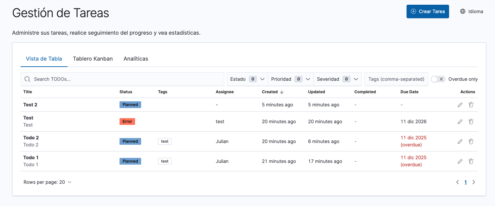
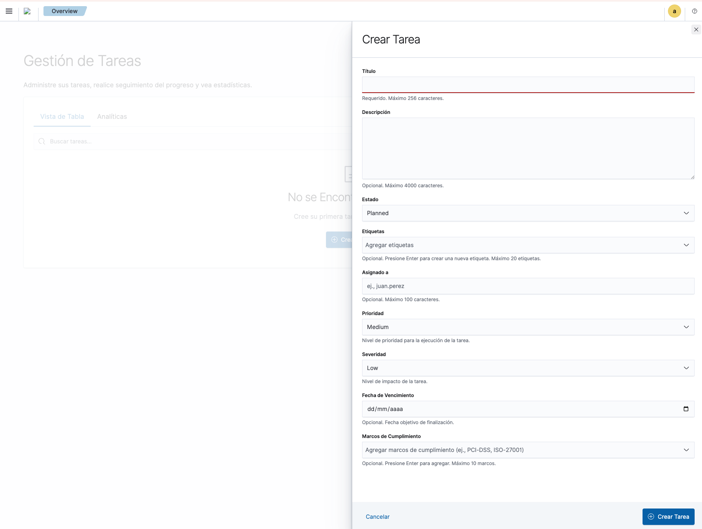
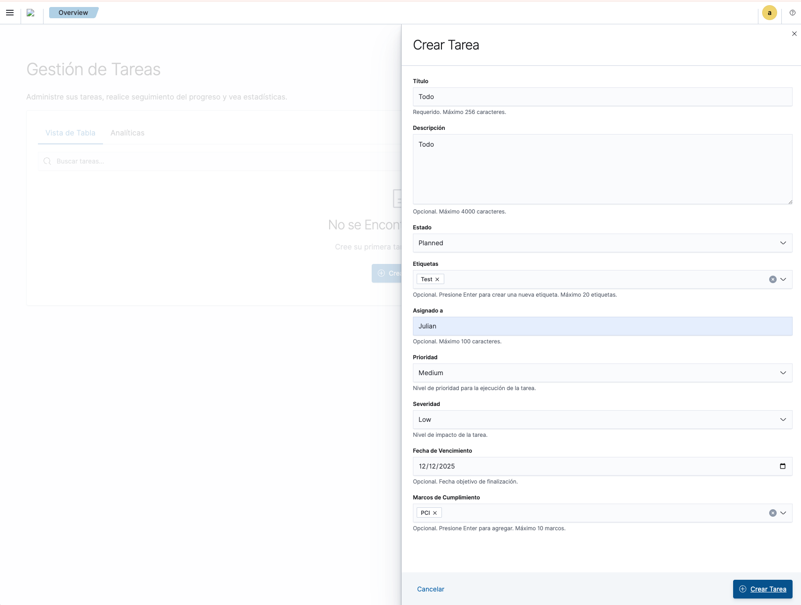
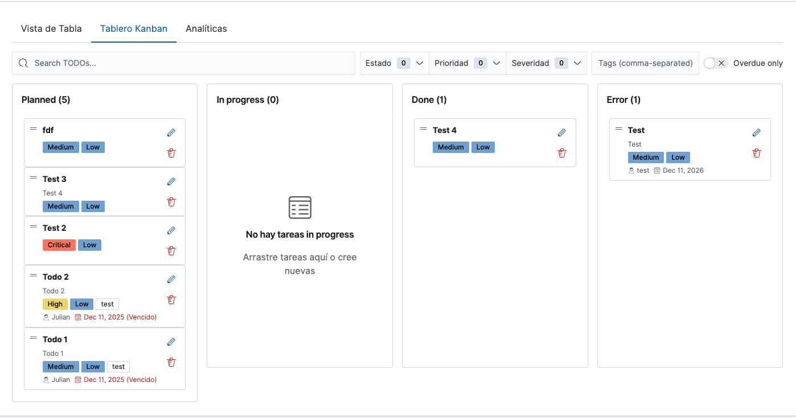
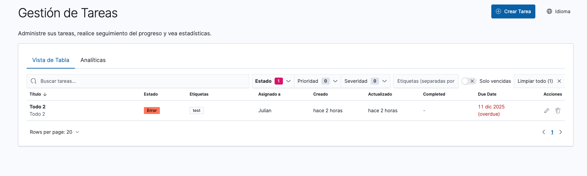
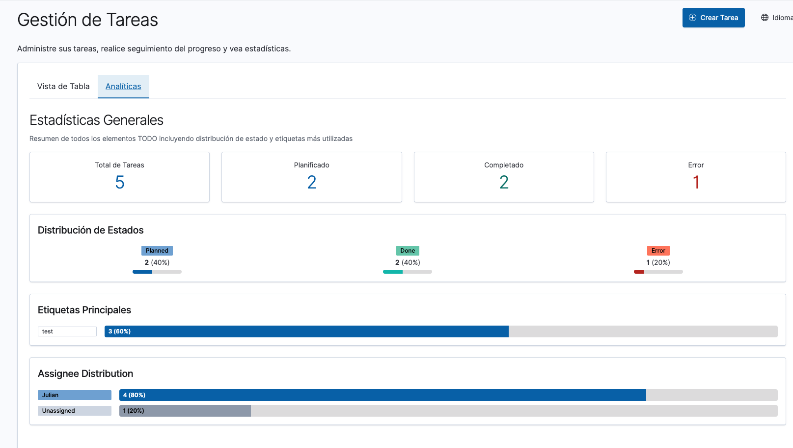
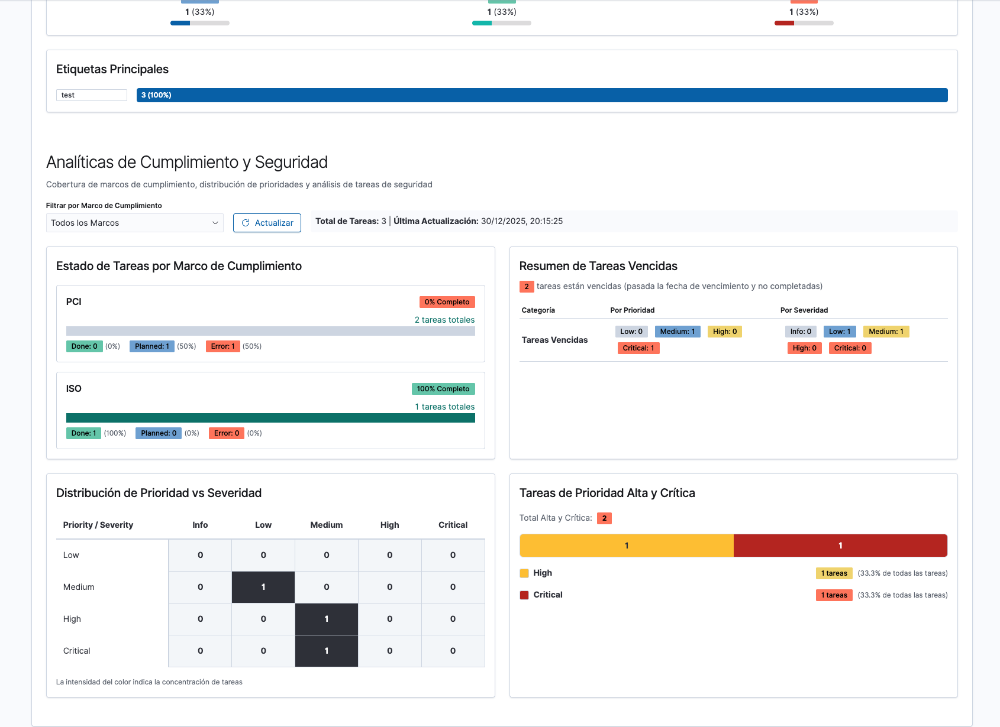
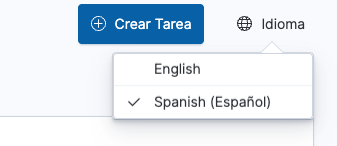

# Task Management Plugin - User Guide

## Table of Contents

- [Introduction](#introduction)
- [Getting Started](#getting-started)
- [Creating Tasks](#creating-tasks)
- [Managing Tasks](#managing-tasks)
- [Kanban Board View](#kanban-board-view)
- [Search and Filtering](#search-and-filtering)
- [Analytics Dashboard](#analytics-dashboard)
- [Compliance and Security Tracking](#compliance-and-security-tracking)
- [Language Preferences](#language-preferences)
- [Tips and Best Practices](#tips-and-best-practices)
- [Keyboard Shortcuts](#keyboard-shortcuts)
- [Troubleshooting](#troubleshooting)

## Introduction

The Task Management Plugin for OpenSearch Dashboards is a comprehensive solution designed specifically for security operations teams and compliance professionals. It provides a centralized platform to track security tasks, compliance requirements, remediation activities, and operational workflows.

### Key Features

- **Full Task Lifecycle Management**: Create, update, track, and complete security-related tasks
- **Multiple View Modes**: Switch between Table View, Kanban Board, and Analytics Dashboard
- **Kanban Board with Drag-and-Drop**: Visual workflow management with intuitive drag-and-drop task status updates
- **Advanced Search and Filtering**: Quickly find tasks using multiple filter criteria
- **Compliance Framework Tracking**: Associate tasks with industry standards (PCI, ISO, HIPAA, SOC2, GDPR, NIST)
- **Priority and Severity Management**: Classify tasks by urgency and impact
- **Real-time Analytics**: Visual insights into task distribution, completion trends, and workload
- **Overdue Task Monitoring**: Identify and address tasks past their due dates
- **Multilingual Support**: Switch between English and Spanish
- **Team Collaboration**: Assign tasks to specific team members

### Who Should Use This Plugin

- **Security Operations (SecOps) Teams**: Track incident response tasks, vulnerability remediation, and security improvements
- **Compliance Officers**: Manage compliance requirements, audit preparation, and regulatory tasks
- **IT Security Managers**: Monitor team workload, prioritize tasks, and track progress
- **Security Analysts**: Organize daily security activities and follow-up actions

## Getting Started

### Accessing the Plugin

1. Log in to OpenSearch Dashboards using your credentials
2. In the left navigation menu, locate and click on **"Task Management"** or **"Gestión de Tareas"**
3. The main task management interface will load with three tabs:
   - **Table View** (Vista de Tabla): Traditional task list and management
   - **Kanban Board** (Tablero Kanban): Visual board with drag-and-drop task management
   - **Analytics** (Analíticas): Dashboard with statistics and visualizations



### Interface Overview

The task management interface consists of several key areas:

- **Header**: Contains the "Create Task" button and language selector
- **Tab Navigation**: Switch between Table View and Analytics
- **Search Bar**: Full-text search across task titles and descriptions
- **Filter Bar**: Multi-criteria filtering options
- **Task Table**: Paginated list of all tasks
- **Pagination Controls**: Navigate through pages and adjust rows per page

## Creating Tasks

### How to Create a New Task

1. Click the **"Create Task"** button (blue button in the top-right corner)
2. A modal form will appear with the following fields



### Task Form Fields

#### Required Fields

**Title** (Título)
- Maximum 256 characters
- Brief, descriptive name for the task
- Example: "Update firewall rules for DMZ"

**Status** (Estado)
- **Planned**: Task is scheduled but not started
- **Done**: Task has been completed
- **Error**: Task encountered issues or failed

#### Optional Fields

**Description** (Descripción)
- Maximum 4,000 characters
- Detailed explanation of the task, requirements, and context
- Supports multi-line text
- Example: "Review and update firewall rules to address CVE-2024-1234. Requires coordination with network team."

**Tags** (Etiquetas)
- Up to 20 tags per task
- Press Enter to create a new tag
- Used for categorization and filtering
- Examples: "firewall", "CVE-2024-1234", "network-security", "urgent"

**Assigned To** (Asignado a)
- Maximum 100 characters
- Name or identifier of the team member responsible
- Examples: "john.doe", "security-team", "analyst-1"

**Priority** (Prioridad)
- **Low**: Routine tasks with flexible timelines
- **Medium**: Standard tasks with normal urgency
- **High**: Important tasks requiring prompt attention

**Severity** (Severidad)
- **Low**: Minor impact if not completed
- **Medium**: Moderate business or security impact
- **High**: Significant impact on security or operations
- **Critical**: Immediate threat or regulatory requirement

**Due Date** (Fecha de Vencimiento)
- Target completion date
- Format: dd/mm/yyyy
- Click the calendar icon to select a date
- Tasks past this date appear in "Overdue Tasks" analytics

**Compliance Frameworks** (Marcos de Cumplimiento)
- Select up to 10 frameworks
- Available options: PCI-DSS, ISO-27001, HIPAA, SOC2, GDPR, NIST
- Press Enter to add a framework
- Used for compliance tracking and reporting



### Saving a Task

1. Fill in at minimum the **Title** and **Status** fields
2. Click **"Create Task"** (blue button at bottom-right)
3. The modal will close and the task will appear in the table
4. A success notification will confirm task creation

### Canceling Task Creation

- Click **"Cancel"** (Cancelar) at the bottom of the form
- Or click the X icon in the top-right corner of the modal
- No data will be saved

## Managing Tasks

### Viewing Task Details

The task table displays the following columns:

- **Title** (Título): Task name and description (if available)
- **Status** (Estado): Current status with color-coded badge
  - Blue badge: Planned
  - Green badge: Done
  - Red badge: Error
- **Tags** (Etiquetas): Associated tags for the task
- **Assigned To** (Asignado a): Team member responsible
- **Created** (Creado): Creation timestamp
- **Updated** (Actualizado): Last modification timestamp
- **Actions** (Acciones): Edit and delete buttons


### Editing a Task

1. Locate the task in the table
2. Click the **pencil icon** in the Actions column
3. The edit form will open with current values pre-filled
4. Modify any fields as needed
5. Click **"Save Changes"** to update the task
6. The table will refresh automatically

### Deleting a Task

1. Locate the task in the table
2. Click the **trash icon** in the Actions column
3. A confirmation dialog will appear
4. Click **"Confirm"** to permanently delete the task
5. The task will be removed from the table immediately

**Warning**: Task deletion is permanent and cannot be undone.

### Pagination

Control how many tasks display per page:

1. Locate the **"Rows per page"** dropdown at the bottom of the table
2. Select from available options:
   - 20 rows
   - 50 rows
   - 100 rows
3. Use the arrow buttons to navigate between pages
4. Current page number is displayed in the center

## Kanban Board View

The Kanban Board provides a visual, column-based interface for managing tasks using drag-and-drop interactions. This view is ideal for teams that prefer visual workflow management and want to quickly move tasks between different stages.



### Accessing the Kanban Board

1. Navigate to the Task Management plugin
2. Click the **"Kanban Board"** (Tablero Kanban) tab
3. The board will load with all tasks organized by status

### Board Structure

The Kanban board is organized into four columns representing task statuses:

#### Column Overview

1. **Planned** (Planificado)
   - Tasks that are scheduled but not yet started
   - Blue color scheme
   - Shows count in column header: "Planned (X)"

2. **In Progress** (En progreso)
   - Tasks currently being worked on
   - Gray color scheme
   - Shows count in column header: "In progress (X)"
   - Displays empty state message when no tasks are in progress

3. **Done** (Completado)
   - Completed tasks
   - Green/teal color scheme
   - Shows count in column header: "Done (X)"

4. **Error** (Error)
   - Tasks that encountered problems or failed
   - Red color scheme
   - Shows count in column header: "Error (X)"

Each column displays the total number of tasks in that status in the column header.

### Task Cards

Each task is represented as a card containing key information:

#### Card Information Display

**Task Title**
- Displayed prominently at the top of the card
- Brief hamburger menu icon (≡) indicates draggable card

**Priority Badge**
- Color-coded badge showing task priority:
  - **Yellow/Orange**: High priority
  - **Red**: Critical priority
  - **Blue**: Medium priority
  - **Gray**: Low priority

**Severity Badge**
- Color-coded badge showing task severity:
  - **Red**: Critical severity
  - **Orange**: High severity
  - **Blue**: Medium severity
  - **Gray**: Low severity

**Tags**
- Displayed as inline badges
- Multiple tags shown when applicable
- Examples: "test", "urgent", "review-needed"

**Assignee Information**
- Shows who is responsible for the task
- Displayed with user icon (👤)
- Format: "👤 [assignee name]"

**Due Date**
- Displayed with calendar icon (📅)
- Format: "📅 MMM DD, YYYY" (e.g., "Dec 11, 2025")
- **Overdue tasks** are highlighted in red with "(Vencido)" label
- Example: "📅 Dec 11, 2025 (Vencido)"

**Task Description** (if available)
- Brief preview shown below the title
- Provides context at a glance

#### Card Actions

Each card includes action icons:

1. **Edit Icon** (pencil/✏️)
   - Located in the top-right corner of the card
   - Click to open the edit form with pre-filled values
   - Allows updating all task fields

2. **Delete Icon** (trash/🗑️)
   - Located next to the edit icon
   - Click to delete the task
   - Shows confirmation dialog before deletion

### Drag-and-Drop Functionality

The Kanban board supports drag-and-drop task management:

#### Moving Tasks Between Columns

1. **Click and hold** on a task card (on the hamburger menu icon or card body)
2. **Drag** the card to the desired column
3. **Drop** the card in the target column
4. The task status automatically updates to match the new column

**Status Mapping**:
- Drop in "Planned" → Task status becomes "planned"
- Drop in "In Progress" → Task status becomes "in_progress"
- Drop in "Done" → Task status becomes "done"
- Drop in "Error" → Task status becomes "error"

**Real-time Updates**:
- Column counts update immediately after moving a task
- Task is persisted to OpenSearch with the new status
- Changes are reflected across all views (Table, Kanban, Analytics)

#### Visual Feedback

During drag operations:
- Card becomes semi-transparent while dragging
- Target column highlights when hovering
- Smooth animation when dropping the card

### Empty State

When a column has no tasks, an empty state is displayed:

**Empty State Features**:
- Icon indicating empty column (document/list icon)
- Message: "No hay tareas in progress" (No tasks in progress)
- Helpful text: "Arrastre tareas aquí o cree nuevas" (Drag tasks here or create new ones)

This guides users to either:
- Drag tasks from other columns
- Create new tasks with that status

### Search and Filters Integration

The Kanban board respects all active filters and search queries from the top bar:

**Available Filters**:
1. **Search Bar**: Filter tasks by title or description
2. **Status Filter** (Estado): Show only selected statuses
3. **Priority Filter** (Prioridad): Filter by priority levels
4. **Severity Filter** (Severidad): Filter by severity levels
5. **Tags Filter**: Filter by specific tags (comma-separated)
6. **Overdue Only**: Show only overdue tasks

**Filter Behavior**:
- Active filters are indicated by count badges next to filter dropdowns
- Filtered tasks appear only in their respective columns
- Drag-and-drop still works on filtered views
- "Clear All" (Limpiar todo) button resets all filters

### Use Cases and Workflows

#### Daily Standup Workflow
1. Open Kanban Board view
2. Review "In Progress" column to see active work
3. Drag completed tasks to "Done" column
4. Move planned tasks to "In Progress" as team starts work
5. Identify blocked tasks and move to "Error" if needed

#### Sprint Planning
1. Filter by assignee to see individual workload
2. Drag high-priority tasks from "Planned" to "In Progress"
3. Balance work across team members
4. Use empty state to identify capacity

#### Incident Response
1. Create urgent task (appears in "Planned")
2. Immediately drag to "In Progress" when responder starts work
3. Move to "Done" when resolved, or "Error" if escalation needed
4. Use tags to track incident ID

#### Visual Progress Tracking
1. Use column counts to see distribution at a glance
2. Identify bottlenecks (too many tasks in one column)
3. Celebrate progress (watching "Done" column grow)
4. Address problems (investigate "Error" column tasks)

### Kanban Board vs Table View

**When to Use Kanban Board**:
- Visual workflow management
- Quick status updates via drag-and-drop
- Team collaboration and daily standups
- Identifying workflow bottlenecks
- Managing active work in progress

**When to Use Table View**:
- Detailed task information review
- Bulk operations on multiple tasks
- Sorting by various fields (created date, updated date, etc.)
- Viewing all task metadata in columns
- Exporting or analyzing task data

**Both views**:
- Share the same underlying data
- Update in real-time
- Support the same search and filtering capabilities
- Allow task editing and deletion

### Tips for Effective Kanban Usage

1. **Limit Work in Progress**: Keep "In Progress" column manageable (5-10 tasks max)

2. **Review "Error" Column Daily**: Address blocked or failed tasks promptly

3. **Use Visual Cues**: Priority and severity badges help identify urgent tasks at a glance

4. **Leverage Overdue Indicators**: Red due dates signal tasks needing immediate attention

5. **Combine with Filters**: Use status filters to focus on specific workflow stages

6. **Regular Cleanup**: Move completed tasks to "Done" to maintain clear board state

7. **Tag Consistency**: Use consistent tags to make filtering more effective

8. **Assignee Visibility**: Clearly see workload distribution across team members

### Keyboard and Accessibility

**Mouse Interactions**:
- Click and drag cards to move between columns
- Click edit icon to modify task details
- Click delete icon to remove tasks

**Accessibility Features**:
- High contrast color coding for status columns
- Clear visual hierarchy with badges and icons
- Readable fonts and spacing
- Color-blind friendly status indicators (icons + colors)

## Search and Filtering

### Full-Text Search

The search bar provides fuzzy matching across task titles and descriptions:

1. Click in the **search field** at the top of the table
2. Type your search query
3. Results update automatically as you type
4. The search matches partial words and handles typos

**Examples**:
- Search "firewall" finds tasks with "firewall", "firewalls", "Firewall"
- Search "CVE" finds all tasks mentioning CVE identifiers
- Search "network security" finds tasks containing both terms


### Filter by Status

1. Click the **"Status"** dropdown (Estado)
2. The badge shows the count of selected statuses
3. Select one or more statuses:
   - Planned
   - Done
   - Error
4. The table updates to show only matching tasks
5. Click the X icon to clear status filters

### Filter by Priority

1. Click the **"Priority"** dropdown (Prioridad)
2. Select one or more priority levels:
   - Low
   - Medium
   - High
3. Only tasks matching selected priorities will display

### Filter by Severity

1. Click the **"Severity"** dropdown (Severidad)
2. Select one or more severity levels:
   - Low
   - Medium
   - High
   - Critical
4. Filter applies immediately

### Filter by Tags

1. Click in the **"Tags"** field (Etiquetas separadas por comas)
2. Type a tag name and press Enter
3. Add multiple tags to filter by
4. **AND logic**: Tasks must have ALL specified tags
5. Click the X icon next to a tag to remove it from the filter

### Show Only Overdue Tasks

1. Check the **"Show only overdue"** checkbox (Solo vencidas)
2. Table displays only tasks past their due date and not marked as "Done"
3. Uncheck to view all tasks again

### Clear All Filters

- Click **"Clear All"** (Limpiar todo) to reset all filters
- Search query, status, priority, severity, tags, and overdue filter will be cleared
- The count of active filters is shown next to the clear button



### Combining Filters

You can combine multiple filters simultaneously:

**Example**: Find all high-priority, critical-severity firewall tasks assigned to the security team:
1. Search: "firewall"
2. Priority: High
3. Severity: Critical
4. Tags: "security-team"

All filters work together using AND logic (tasks must match ALL criteria).

## Analytics Dashboard

The Analytics tab provides comprehensive insights into your task management data.



### General Statistics

Four summary cards display overall task metrics:

- **Total Tasks** (Total de Tareas): Total number of all tasks
- **Planned** (Planificado): Count of tasks with "Planned" status (blue)
- **Completed** (Completado): Count of tasks marked "Done" (teal)
- **Error** (Error): Count of failed or problematic tasks (red)

These cards provide an at-a-glance view of workload distribution.

### Status Distribution

Visual progress bars show the relative proportion of each status:

- **Planned**: Blue bar with count and percentage
- **Done**: Teal/green bar with count and percentage
- **Error**: Red bar with count and percentage

The percentage shows each status as a portion of total tasks, helping identify completion rates and problem tasks.

### Top Tags

A horizontal bar chart displays the most frequently used tags:

- Each bar represents one tag
- Length indicates the count of tasks with that tag
- Percentage shows tag usage relative to total tasks
- Helps identify common task categories and themes

### Last Update Timestamp

The analytics refresh in real-time. The timestamp shows when data was last retrieved:

**Format**: dd/mm/yyyy, HH:mm:ss

Click the **"Refresh"** (Actualizar) button to manually reload analytics data.

## Compliance and Security Tracking

The Compliance and Security Analytics section helps teams monitor regulatory requirements and security tasks.



### Filter by Compliance Framework

1. Use the **"Filter by Compliance Framework"** dropdown
2. Select a specific framework:
   - All Frameworks (default)
   - PCI
   - ISO
   - HIPAA
   - SOC2
   - GDPR
   - NIST
3. Click **"Refresh"** (Actualizar) to update the analytics

### Task Status by Compliance Framework

This section shows task progress for each compliance framework:

**Each framework displays**:
- Framework name (e.g., "PCI", "ISO")
- Completion percentage badge
- Total task count
- Status breakdown with color-coded bars:
  - Green: Done
  - Blue: Planned
  - Red: Error
- Count and percentage for each status

**Example**:
```
PCI                                    0% Complete
2 tasks total

Done: 0 (0%)    Planned: 1 (50%)    Error: 1 (50%)
```

This helps compliance officers quickly identify:
- Which frameworks have outstanding tasks
- Completion rates for each framework
- Problem areas requiring attention

### Overdue Tasks Summary

The **"Overdue Tasks Summary"** panel highlights tasks past their due date that are not completed.

**Key Information**:
- Total count of overdue tasks (red badge)
- Note: "tasks are overdue (past due date and not completed)"

**Breakdown by Priority**:
- Low: Count of overdue low-priority tasks
- Medium: Count of overdue medium-priority tasks
- High: Count of overdue high-priority tasks

**Breakdown by Severity**:
- Info: Informational overdue tasks
- Low: Low-severity overdue tasks
- Medium: Medium-severity overdue tasks
- High: High-severity overdue tasks
- Critical: Critical overdue tasks (red badge)

This section helps teams identify urgent tasks that have slipped past their deadlines.

### Priority vs Severity Distribution

A matrix table shows task distribution across priority and severity levels:

**Matrix Structure**:
- **Rows**: Priority levels (Low, Medium, High, Critical)
- **Columns**: Severity levels (Info, Low, Medium, High, Critical)
- **Cells**: Count of tasks matching that priority/severity combination
- Darker shading indicates higher task concentration

**Color intensity**: Helps visually identify areas with the most tasks.

**Use Cases**:
- Identify high-priority, high-severity tasks requiring immediate attention
- Balance workload across different task classifications
- Spot patterns in task distribution

### High and Critical Priority Tasks

Two horizontal bar charts show tasks requiring immediate attention:

**High Priority Tasks**:
- Yellow/orange bar
- Count and percentage of high-priority tasks

**Critical Priority Tasks**:
- Red bar
- Count and percentage of critical-priority tasks

These visualizations help managers quickly assess urgent workload.

## Language Preferences

The plugin supports multiple languages for international teams.



### Changing Language

1. Click the **"Language"** button (Idioma) in the top-right corner
2. A dropdown menu appears with available languages:
   - **English**: Full English interface
   - **Spanish (Español)**: Full Spanish interface
3. Click your preferred language
4. The entire interface immediately updates:
   - Navigation labels
   - Form fields
   - Button text
   - Analytics labels
   - Error messages

### Supported Languages

Currently supported languages:
- English
- Spanish (Español)

All user-facing text, including field labels, button text, and help messages, is translated.

**Note**: Task data (titles, descriptions, tags) remains in the language entered by users. Only interface elements are translated.

## Tips and Best Practices

### Task Creation Best Practices

1. **Use Descriptive Titles**: Make titles specific enough to understand at a glance
   - Good: "Patch Apache web servers for CVE-2024-1234"
   - Poor: "Server patch"

2. **Leverage Tags**: Use consistent tagging conventions
   - Technology tags: "firewall", "apache", "windows"
   - Category tags: "vulnerability", "maintenance", "compliance"
   - Team tags: "network-team", "security-ops"

3. **Set Realistic Due Dates**: Account for dependencies and team capacity

4. **Assign Ownership**: Always specify who is responsible

5. **Link to Compliance**: Associate tasks with relevant frameworks for reporting

### Search and Filter Tips

1. **Combine Filters**: Use multiple filters to narrow results
   - Example: Priority=High + Status=Planned + Tag=firewall

2. **Use Overdue Filter**: Regularly check overdue tasks to prevent backlog

3. **Tag-Based Workflows**: Create standard tags for common task types
   - "urgent", "review-needed", "waiting-approval"

4. **Save Filter Combinations**: Document common filter combinations your team uses

### Analytics Usage

1. **Daily Standup**: Review "Planned" count and overdue tasks

2. **Weekly Review**: Check completion trends and status distribution

3. **Compliance Reporting**: Filter by framework to generate compliance status reports

4. **Workload Balancing**: Use Priority vs Severity matrix to distribute tasks

5. **Tag Analysis**: Top Tags chart reveals which areas consume most effort

### Workflow Recommendations

**Incident Response Workflow**:
1. Create task with Status=Planned, Priority=High, Severity=Critical
2. Add tags: "incident", "IR-2024-001"
3. Assign to incident responder
4. Set due date based on SLA
5. Link to compliance framework if applicable
6. **Kanban**: Drag from "Planned" to "In Progress" when responder starts work
7. Update status to Done when resolved (or drag to "Done" column)

**Vulnerability Management**:
1. Create task per CVE or vulnerability
2. Tags: CVE ID, affected system, "vulnerability"
3. Priority based on CVSS score
4. Severity based on business impact
5. Track compliance framework requirements (PCI, ISO)
6. **Kanban**: Use visual board to prioritize patching by dragging high-severity tasks first
7. Use filters to prioritize patching efforts

**Compliance Audit Preparation**:
1. Create tasks for each control requirement
2. Link to appropriate framework (PCI, ISO, SOC2)
3. Assign to control owners
4. Set due dates before audit
5. **Kanban**: Use board view during daily standups to track progress visually
6. Use Analytics to monitor completion by framework
7. Filter by framework to generate audit evidence

**Kanban Daily Standup Workflow**:
1. Open Kanban Board view at start of day
2. Review "In Progress" column with the team
3. Drag completed tasks to "Done" as team members report completion
4. Move new tasks from "Planned" to "In Progress" as work begins
5. Identify and discuss any tasks in "Error" column
6. Use overdue indicators to highlight urgent items

## Keyboard Shortcuts

While the plugin primarily uses mouse interaction, these keyboard shortcuts improve efficiency:

**General Navigation**:
- `Tab`: Move between form fields
- `Shift + Tab`: Move backward between fields
- `Enter`: Submit forms (when focus is on submit button)
- `Esc`: Close modal dialogs

**Form Interaction**:
- Type and press `Enter` in tag fields to add tags
- Type and press `Enter` in compliance framework fields to add frameworks
- Use arrow keys in dropdowns to select options

## Troubleshooting

### Tasks Not Appearing in Table

**Possible Causes**:
1. Active filters hiding tasks
2. Pagination on a different page
3. Search query too specific

**Solutions**:
- Click "Clear All" to reset filters
- Navigate to page 1 using pagination controls
- Clear search query
- Increase "Rows per page" to 100

### Search Not Finding Tasks

**Possible Causes**:
1. Typo in search query
2. Task uses different terminology
3. Search field is case-sensitive for special characters

**Solutions**:
- Check spelling
- Try broader search terms
- Search for partial words
- Use tags filter instead

### Analytics Not Updating

**Possible Causes**:
1. Browser cache
2. Need manual refresh

**Solutions**:
- Click the "Refresh" button in analytics
- Navigate to Table View and back to Analytics
- Refresh browser page (F5)

### Task Creation Fails

**Possible Causes**:
1. Title field is empty (required)
2. Title exceeds 256 characters
3. Description exceeds 4,000 characters
4. Too many tags (limit: 20)
5. Too many compliance frameworks (limit: 10)

**Solutions**:
- Ensure title is filled in
- Shorten title or description
- Remove excess tags or frameworks
- Check for validation error messages in the form

### Filter Not Working as Expected

**Remember**:
- Tag filters use AND logic (must have ALL tags)
- Status, Priority, and Severity use OR logic (must match ANY selected)
- "Show only overdue" also checks Status (excludes "Done" tasks)

**Solutions**:
- Review which filters are active
- Clear individual filters one at a time
- Use "Clear All" and reapply filters

### Language Not Changing

**Solutions**:
- Ensure you clicked the language option (not just opened the menu)
- Refresh the browser page
- Clear browser cache

### Overdue Tasks Not Showing

**Possible Causes**:
1. Task status is "Done" (Done tasks are excluded from overdue)
2. Due date is in the future
3. Due date is not set

**Solutions**:
- Verify task status is Planned or Error
- Check due date is in the past
- Ensure due date field is filled in

### Kanban Board Issues

#### Drag-and-Drop Not Working

**Possible Causes**:
1. Browser compatibility issue
2. Card is being clicked instead of dragged
3. JavaScript error in browser console

**Solutions**:
- Use a modern browser (Chrome, Firefox, Edge, Safari)
- Click and hold for 1 second before dragging
- Check browser console for errors (F12)
- Refresh the page
- Try using the edit button to change status instead

#### Task Not Moving Between Columns

**Possible Causes**:
1. Drop was not completed properly
2. Network connection issue
3. OpenSearch backend error

**Solutions**:
- Ensure you drop the card fully inside the target column
- Check network connection
- Refresh the page to see if status updated
- Use Table View to manually update status
- Check browser console for error messages

#### Column Counts Not Updating

**Possible Causes**:
1. Page needs refresh
2. Active filters affecting display
3. Caching issue

**Solutions**:
- Refresh the page (F5)
- Clear all filters and check counts
- Navigate to Table View and back to Kanban
- Clear browser cache

#### Cards Not Displaying All Information

**Possible Causes**:
1. Data missing from task record
2. Display resolution too low
3. Browser zoom level

**Solutions**:
- Edit the task to add missing fields
- Increase browser window size
- Reset browser zoom to 100% (Ctrl+0 or Cmd+0)
- Check task in Table View to see all data

## Support and Feedback

For additional support:

1. **Documentation**: Refer to the full technical documentation in the `docs/` directory
2. **API Reference**: See `docs/api.md` for programmatic integration
3. **Architecture Guide**: Understand system design in `docs/architecture.md`
4. **Feature List**: Complete feature documentation in `docs/features.md`

For issues, feature requests, or questions, contact your OpenSearch Dashboards administrator.

---

**Last Updated**: December 2025
**Plugin Version**: 1.0.0
**OpenSearch Dashboards Version**: 2.16.0
